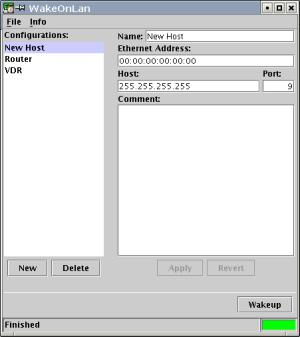

# java-wakeonlan

## What is wakeonlan?

wakeonlan is a small OS independent java program that sends 'magic packets' to wake-on-lan enabled ethernet adapters and motherboards in order to switch on the called machine.It runs on every machine with an installed 1.4 java runtime. 

wakeonlan can be used by commandline or by a graphical user interface. You can use wakeonlan as a java library too. It provides a util class to wake up remote machines. See wakeonlan javadoc for more information.

## Features

* Save and load different configuration files.
* Batch wake up lets you wake up all selected machines with one click.
* Use stored configurations from the command line.
* Localized in german, spanish and english. If you like to translate wakeonlan, let me know!
* Portable. Runs on Windows, Linux, Solaris and every OS that is supported by java.
* Run everywhere using java web start.

## License

wakeonlan is licensed under the Lesser GNU Public License. A copy of this license is available at http://www.gnu.org/licenses/old-licenses/gpl-2.0.txt

## Requirements

* java 1.4 compatible runtime (E.g. http://openjdk.java.net/)
* JSAP - [Java Simple Argument Parser](http://www.martiansoftware.com/jsap/)

Optional:

* Apache Ant (http://ant.apache.org) if you install from sources.
* JUnit (http://www.junit.org) to build an run the tests.

## Installation

Just unzip the archive. This will create a directory wakeonlan with all necessary files. 

If you are installing from sources, change to the unzipped directory and run 

    ant 

This creates a directory 'deploy' with the necessary file to run wakeonlan. To create the javadoc, run: 

    ant javadoc

## Usage

Change to the directory where you installed wakeonlan.
Run on the command line 

    java -jar wakeonlan.jar 

to start the graphical user interface. Run 

    java -jar wakeonlan.jar --help 

to get the command line help. 

    java -jar wakeonlan.jar -i 192.168.0.255 00:50:95:10:95:F5 

This will wake up the machine with hardware address 00:50:95:10:95:F5, in the local subnet. 

    java -jar wakeonlan.jar machine1 machine2 

Wakes up machine1 and machine2 stored in the configuration.